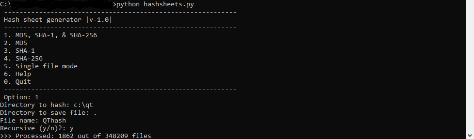
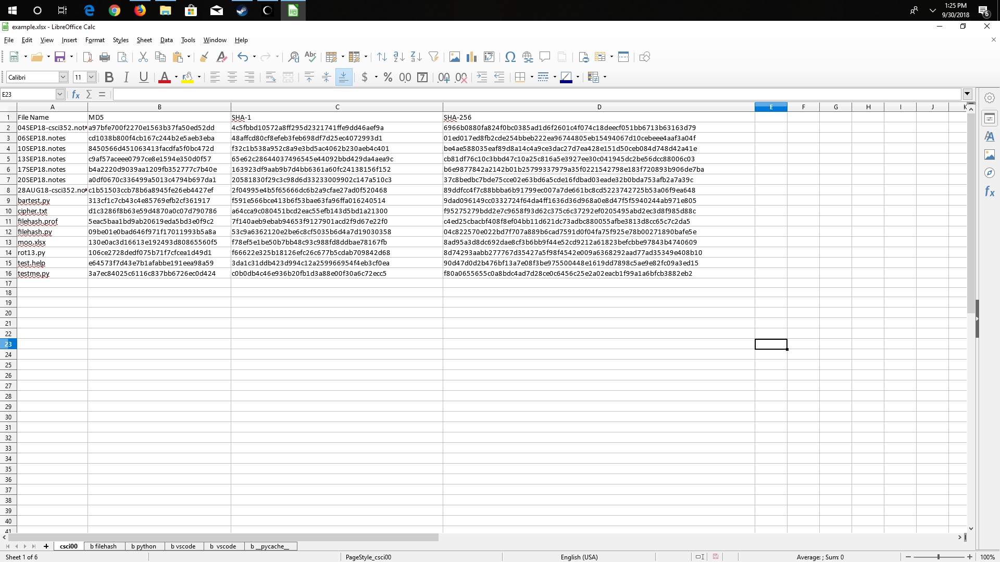

# HashSheets
Search directories for list of files and generate md5, sha-1, and sha256 hashsums. Second time using python, really enjoyed this one.

# Example run

# Example output spreadsheet

# Carbonized Code

